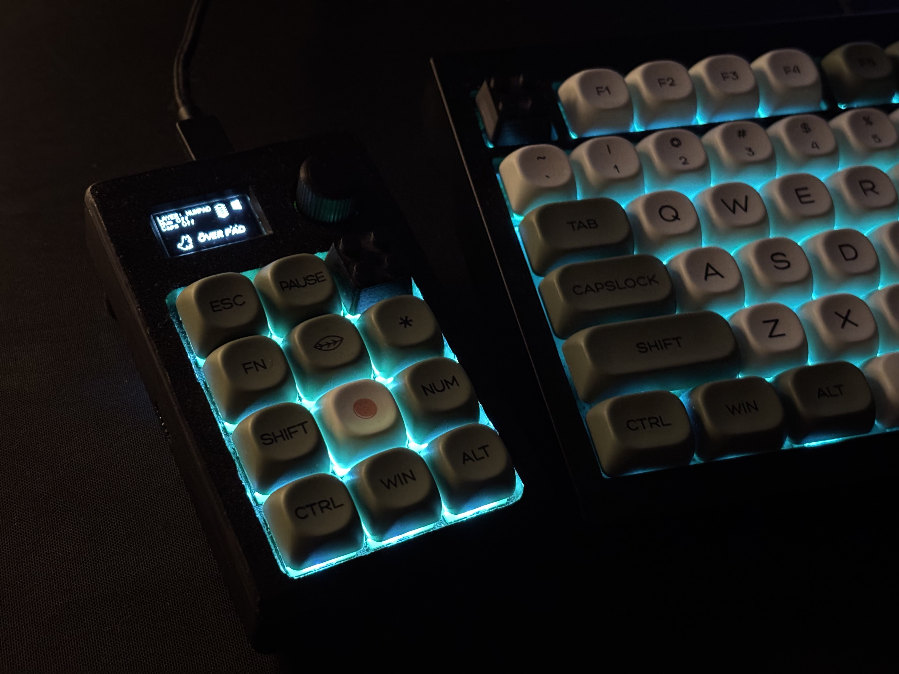
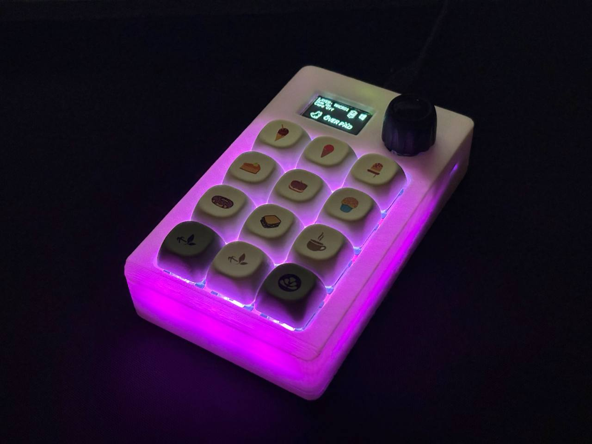
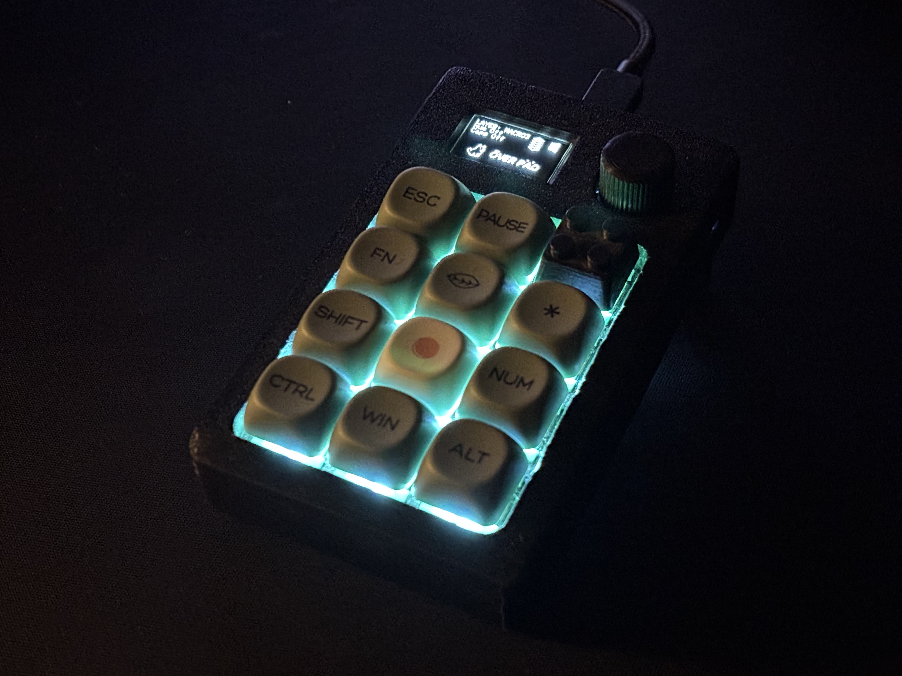

# OVERPAD

A custom 12-key mechanical macropad with a rotary encoder, OLED display and RGB, powered by QMK.

<sub>[@lastlxrd](https://github.com/lastlxrd) · 2024</sub>

<p align="center">
  
</p>

<p align="center">
  
</p>

<p align="center">
  
</p>

OVERPAD is a compact programmable macropad built around the ATmega32U4 and QMK Firmware.

## Features

- 12 mechanical keys
- Rotary encoder with push button
- ATmega32U4 microcontroller
- 128×64 OLED display
- 12× WS2812 RGB LEDs
- QMK Firmware
- VIA support
- USB HID
- NKRO support
- Mouse keys and media controls
- Caterina bootloader

## Hardware

| Component | Description |
|---|---|
| MCU | ATmega32U4 |
| Keys | 12 mechanical keys |
| Encoder | Rotary encoder with push button |
| Display | 128×64 OLED |
| RGB | 12× WS2812 LEDs |
| Firmware | QMK |
| Configuration | VIA |
| Bootloader | Caterina |

## VIA configuration

OVERPAD supports VIA, allowing the keymap to be customized through a graphical interface without recompiling the firmware.

With VIA you can:

- Remap all 12 keys
- Configure multiple layers
- Assign media and system controls
- Create macros
- Change shortcuts and key functions
- Customize the layout without reflashing the firmware

The VIA definition is included in the repository:

```text
keymaps/via/via.json
```

### How to customize OVERPAD with VIA

1. Connect OVERPAD to your computer via USB.

2. Open VIA.

3. If OVERPAD is detected automatically, open the **Configure** tab and start remapping the keys.

4. If the keyboard is not detected automatically, enable the **Design** tab in VIA settings.

5. Load:

```text
keymaps/via/via.json
```

6. Return to the **Configure** tab.

7. Select any key on the OVERPAD layout and assign the desired function.

Changes are written directly to the keyboard and take effect immediately.

> OVERPAD must be running the VIA-enabled QMK firmware for VIA configuration to work.

## Firmware

OVERPAD firmware is based on QMK Firmware.

The repository contains the keyboard configuration files:

```text id="a8ulgl"
.
├── config.h
├── keyboard.json
├── rules.mk
├── LICENSE
├── NOTICE
├── LICENSE-ASSETS.md
├── docs/
│   ├── overpad1.jpg
│   ├── overpad2.jpg
│   └── overpad3.jpg
└── README.md
```

To use the keyboard definition inside a QMK installation, place it in:

```text id="mnyxy5"
qmk_firmware/keyboards/lastlxrd/overpad/
```

A QMK keymap can then be placed inside:

```text id="8xjpp6"
keymaps/default/
```

and compiled with:

```bash id="k6jx0a"
qmk compile -kb lastlxrd/overpad -km default
```

or flashed with:

```bash id="hzysyd"
qmk flash -kb lastlxrd/overpad -km default
```

> A `keymaps/default/keymap.c` file is required to build a complete firmware image.

## About

OVERPAD is an early custom hardware project developed in 2024.

The project combines PCB design, embedded firmware and mechanical keyboard hardware in a compact programmable controller.

## License

OVERPAD firmware and keyboard configuration files are licensed under the GNU General Public License v2.0 or later (`GPL-2.0-or-later`).

The firmware is based on QMK Firmware, which is distributed under the GNU General Public License.

Original project photographs and media located in `docs/` are not covered by the firmware license unless explicitly stated otherwise.

See `LICENSE`, `NOTICE` and `LICENSE-ASSETS.md` for details.

## Author

Designed and developed by [lastlxrd](https://github.com/lastlxrd).